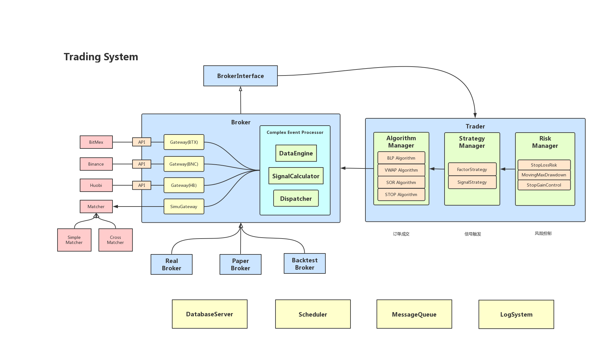
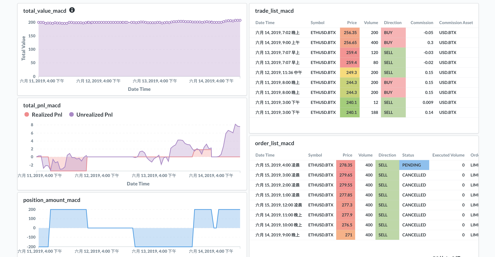
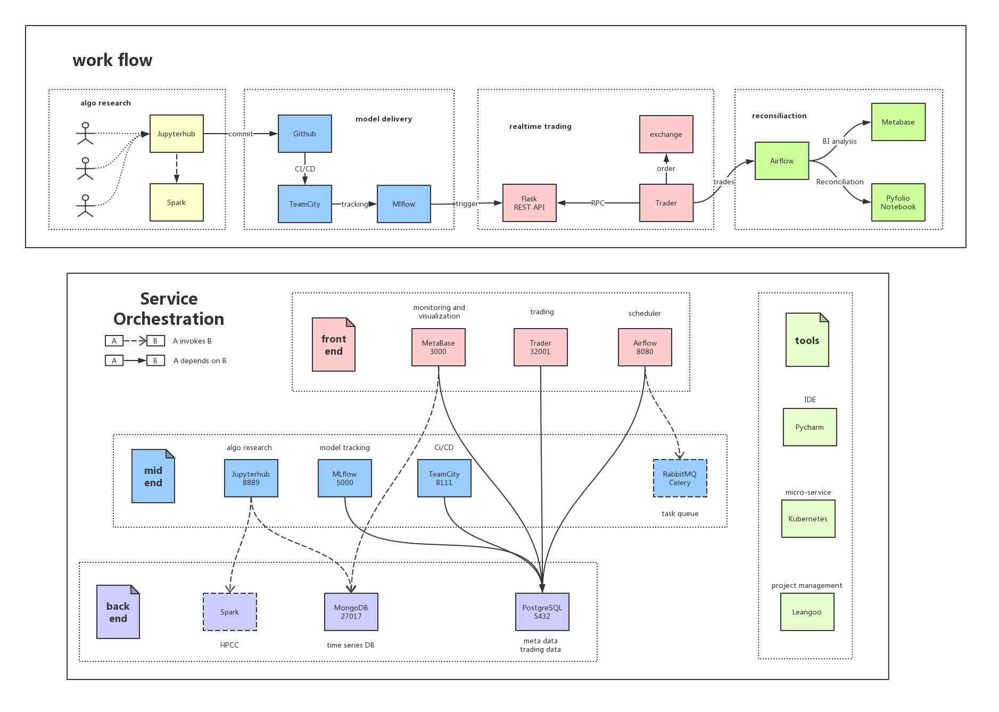

## quantitative trading framework for crypto-trading

### Trading System

> For demonstration ONLY! Part of codes are removed from the project.

Trading System provides services of back-testing, paper-trading and firm-trading for crypto-currency. It contains

-	multiple exchanges (Binance, BitMex, Huobi) with asynchronous connection
-	multiple strategies supporting tick message with 10,000 TPS, trading spot, futures and swaps
-	multiple algorithms for order execution including SOR, TWAP, STOP, Best Limit Price
-	OMS for order routing, position management, risk checking, data persistence and real time P&L calculation
-	back-test platform with different matching mechanisms and optimizing targets
-	other: MVC, unit test, RPC, Agile

Key technology: layered architecture; design patterns; OOP; RPC; ORM; Fabric; MongoDB; ZeroMQ; Unit Test

---

### Algorithm Platform

> Codes to be committed...

Algorithm Platform provide full life cycle management for model development. It contains  

- **front end**: *jtrader* + *airflow* + *metabase* for business of trading
    - *jtrader* deals with *7\*24* realtime trading  
    - *airflow* schedules daily works: data crawling, model retraining and PnL reconciliation
    - *metabase* presents visualization of trading analysis and PnL status 
- **mid end**: *jupyterhub* + *teamcity* + *mlflow* for algorithm development
    - *jupyterhub* integrates data, computing resource together with paralleled computing framework for research
    - *mlflow* provides service for model tracking and deployment of REST API
    - *teamcity* ensures CI/CD for algorithm
- **back end**: *spark* + *mongodb* + *postgres* for distributed storing and high performance computing
    - *spark* gives platform to train model larger than memory
    - *mongodb* stores time-series data while *postgres* for meta data of applications

Key technology: layered architecture; Python; Docker; DevOps; TeamCity; Mlflow; Airflow; Metabase; Postgres; MongoDB
